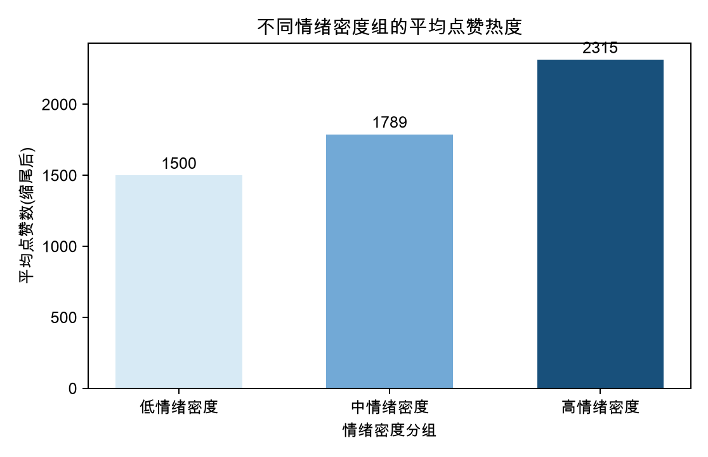
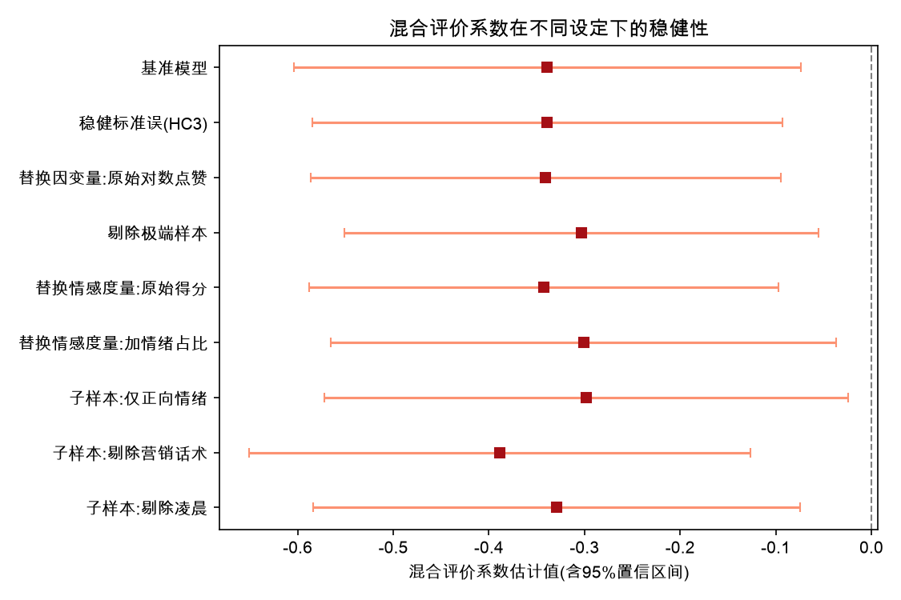

# 一页读懂本研究

## 研究问题

小红书食品种草笔记通常带有明显的情感表达。本研究想回答：**笔记写得更积极、情绪更集中，是否更容易获得点赞？如果一篇笔记同时包含推荐与批评，这种混合评价又会怎样影响热度？**

研究对象是小红书的商品笔记正文，而不是评论区回复。点赞数作为内容热度的主要衡量指标。

## 数据如何形成

本研究从 9999 条小红书商品笔记原始数据出发，依次完成低质量文本清理、食品类别识别和种草文本筛选。

| 数据阶段 | 样本量 | 对应文件 |
| --- | ---: | --- |
| 原始商品笔记 | 9999 | [查看清洗汇总](./最终成果汇总/03_数据结果/02_筛选与清洗说明/小红书商品笔记_清洗汇总.csv) |
| 清洗后商品笔记 | 9692 | [查看清洗后数据](./最终成果汇总/03_数据结果/01_核心数据/小红书商品笔记_清洗后数据.csv) |
| 食品类笔记 | 3320 | [查看筛选汇总](./最终成果汇总/03_数据结果/02_筛选与清洗说明/小红书食品种草笔记_筛选汇总.csv) |
| 最终食品种草笔记 | 2899 | [查看情感分析数据](./最终成果汇总/03_数据结果/01_核心数据/小红书食品种草笔记_情感分析数据.csv) |

最终样本占食品类笔记的 87.32%。为减弱爆款和极端长文本对结果的干扰，分析中还对点赞量、文本长度和情感得分进行了缩尾处理；具体阈值见 [研究优化汇总](./最终成果汇总/03_数据结果/02_筛选与清洗说明/小红书食品种草笔记_研究优化汇总.csv)。

## 分析了哪些因素

研究把笔记文本转换为可统计的变量，重点包括：

- **情感方向**：正向、负向或中性；
- **情绪密度**：情感词在文本中的集中程度；
- **混合评价**：是否同时出现较明显的正向与负向表达；
- **控制变量**：文本长度、配图数量、话题标签、标点、营销话术和发布时间等。

变量的计算结果集中在 [变量统计结果](./最终成果汇总/03_数据结果/03_变量统计结果/)；模型以对数化并缩尾后的点赞量衡量热度，详细设定见 [模型说明](./最终成果汇总/03_数据结果/05_结果说明/小红书食品种草笔记_模型说明.md)。

## 主要发现

### 1. 情绪密度呈正向趋势，但证据不够稳定

分组统计中，情绪密度越高，平均点赞表现越好。基准估计的系数为 0.0949；采用 HC3 稳健标准误后，p 值为 0.1264，没有达到常用的 10% 显著性水平。因此，更稳妥的表述是：**情绪表达集中可能有利于互动，但现有样本不足以确认这一关系稳定存在。**

[查看情绪密度稳健性结果](./最终成果汇总/03_数据结果/04_模型结果/第四部分_鲁棒性_情绪密度.csv)

### 2. 混合评价与点赞热度显著负相关

最终样本中有 359 条混合评价笔记。控制其他变量后，混合评价的系数为 -0.3389，HC3 稳健标准误下 p 值为 0.0069；替换因变量、剔除极端样本和调整模型后，系数仍保持显著为负。这是本研究中最稳定的情感变量结果。

[查看混合评价稳健性结果](./最终成果汇总/03_数据结果/04_模型结果/第四部分_鲁棒性_混合评价.csv)

### 3. 内容呈现因素同样重要

基准回归中，配图数量与点赞热度显著正相关；感叹号、问号、营销话术和非凌晨发布时间也表现出显著关联。这说明食品种草笔记的热度不只与情感有关，也与图文呈现和发布方式有关。

[查看完整基准回归结果](./最终成果汇总/03_数据结果/04_模型结果/第四部分_基准回归关键结果.csv)

## 如何理解结论

本研究识别的是变量之间的统计关联，而不是严格的因果效应。点赞热度还可能受账号粉丝基础、内容质量、平台推荐机制等未完全控制因素影响。因此，结论适合用于描述规律和提出后续研究方向，不宜直接表述为“某种情感一定导致更多或更少点赞”。

## 最终成果入口

1. [下载最终汇报 PPT](./最终成果汇总/02_PPT最终版/基于文本挖掘的小红书食品种草笔记情感对点赞热度的影响研究_最终版.pptx)
2. [下载论文稿](./最终成果汇总/01_论文与说明/基于文本挖掘的小红书食品种草笔记情感对点赞热度的影响研究_论文稿.docx)
3. [阅读完整项目导读](./项目导读.md)
4. [查看全部数据结果说明](./最终成果汇总/03_数据结果/README.md)
