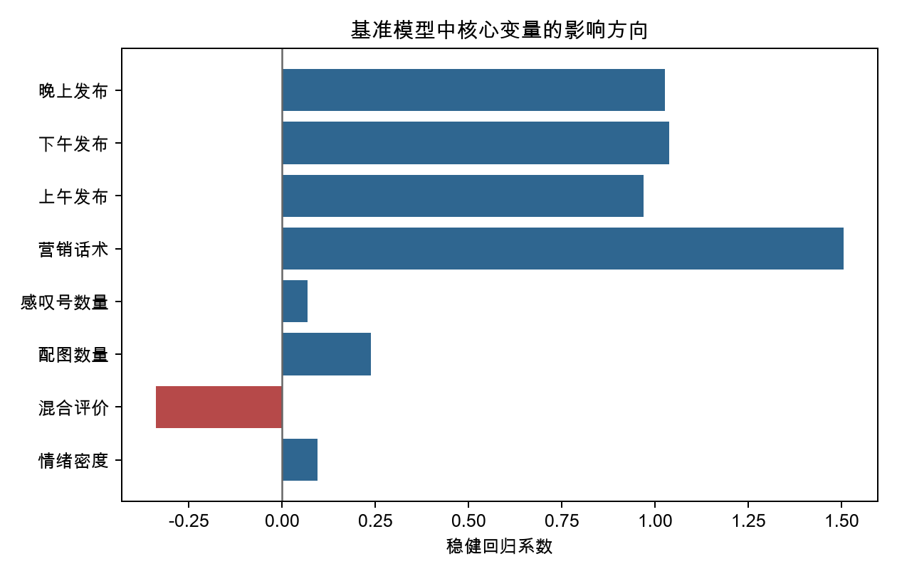

# 项目导读：数据如何变成研究结论

这份导读按研究实际发生的顺序组织。读者可以沿着“原始数据—样本—变量—模型—成果”一路阅读，每一步都附有对应结果文件。

如果只想快速了解结论，请先看 [一页研究摘要](./研究摘要.md)。

## 1. 从原始商品笔记开始

研究最初获得 9999 条小红书商品笔记。数据包含标题、正文、点赞、收藏、评论、发布时间、配图数量和商品类别等字段。

第一步清理低质量、过短和营销噪声过强的文本，最终保留 9692 条。清理数量和规则可在 [商品笔记清洗汇总](./最终成果汇总/03_数据结果/02_筛选与清洗说明/小红书商品笔记_清洗汇总.csv) 中查看，清洗结果见 [商品笔记清洗后数据](./最终成果汇总/03_数据结果/01_核心数据/小红书商品笔记_清洗后数据.csv)。

## 2. 筛出食品种草研究样本

本研究并不分析所有商品笔记，而是先识别食品类内容，再根据文本和字段特征筛出具有种草表达的笔记。

筛选后得到 3320 条食品类笔记，其中 2899 条被识别为食品种草笔记，占食品样本的 87.32%。完整数量见 [食品种草样本筛选汇总](./最终成果汇总/03_数据结果/02_筛选与清洗说明/小红书食品种草笔记_筛选汇总.csv)。

用于后续分析的样本底稿是 [食品种草笔记清洗后数据](./最终成果汇总/03_数据结果/01_核心数据/小红书食品种草笔记_清洗后数据.csv)。

## 3. 把文本内容转换为情感变量

为了回答“情感表达是否与点赞热度有关”，研究从正文中构建了情感方向、情感得分、情绪强度、情绪密度和混合评价等变量，同时整理文本长度、配图数量、发布时间等控制变量。

最终变量级数据见 [情感分析核心数据](./最终成果汇总/03_数据结果/01_核心数据/小红书食品种草笔记_情感分析数据.csv)。如果想分别查看各变量的分组表现，可以继续打开：

- [情感方向统计](./最终成果汇总/03_数据结果/03_变量统计结果/小红书食品种草笔记_变量分析_情感方向.csv)
- [情绪密度统计](./最终成果汇总/03_数据结果/03_变量统计结果/小红书食品种草笔记_变量分析_情绪密度.csv)
- [混合评价统计](./最终成果汇总/03_数据结果/03_变量统计结果/小红书食品种草笔记_变量分析_混合评价.csv)
- [发布时间统计](./最终成果汇总/03_数据结果/03_变量统计结果/小红书食品种草笔记_变量分析_发布时间.csv)

## 4. 用模型检验情感与点赞热度的关系

描述性统计只能说明不同组的点赞表现有差异，还不能判断这种差异在控制其他因素后是否仍然存在。因此，研究进一步以点赞热度为因变量进行回归分析，并控制文本、配图、发布时间等特征。

结果需要分两层理解：

- **描述性现象**：正向文本和高情绪密度文本的平均点赞表现更好，见 [变量结论对应表](./最终成果汇总/03_数据结果/03_变量统计结果/小红书食品种草笔记_变量分析_变量结论对应表.csv)。
- **回归结果**：情绪密度的正向系数在稳健标准误下不显著；混合评价则与点赞热度稳定地显著负相关，见 [基准回归关键结果](./最终成果汇总/03_数据结果/04_模型结果/第四部分_基准回归关键结果.csv)。

为了检查结论是否依赖某一种模型设定，项目还进行了替换因变量、剔除极端样本和子样本分析：

- [情绪密度稳健性检验](./最终成果汇总/03_数据结果/04_模型结果/第四部分_鲁棒性_情绪密度.csv)
- [混合评价稳健性检验](./最终成果汇总/03_数据结果/04_模型结果/第四部分_鲁棒性_混合评价.csv)

## 5. 查看最终成果

分析结果最终被整理为汇报 PPT、论文稿、数据表和图表。GitHub 通常会下载而不是在线预览 Word 和 PowerPoint 文件，这是正常现象。

1. [下载最终汇报 PPT](./最终成果汇总/02_PPT最终版/基于文本挖掘的小红书食品种草笔记情感对点赞热度的影响研究_最终版.pptx)
2. [下载论文稿](./最终成果汇总/01_论文与说明/基于文本挖掘的小红书食品种草笔记情感对点赞热度的影响研究_论文稿.docx)
3. [查看完整数据结果说明](./最终成果汇总/03_数据结果/README.md)
4. [查看全部图表](./最终成果汇总/04_图表/)

## 研究边界

本项目分析的是小红书商品笔记正文，不是评论区回复。现有结果反映情感特征与点赞热度之间的相关关系，不能直接证明因果关系；账号影响力和平台推荐机制等未观测因素仍可能影响结果。
